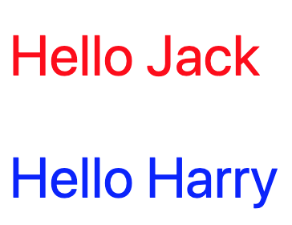

export { future as theme } from 'mdx-deck/themes'


# Intro to Svelte 3

---

 

# Jack Smith

* Dad - Boys, 2 & 4
* Wausau Coated Products - Senior IT Programmer Analyst
* Wausau.js - Organizer 
* Sythas Software LLC - Founder

---

# Upcomming Events

* [That Conference](https://www.thatconference.com/) - Wisconsin Dells, August 5-8, 2019
* [CWITC](https://cwitc.org/) - Stevens Point, October 12, 2019
* [Central WI Developers Group](https://www.meetup.com/Central-WI-Developers-Group/)
* [Central Wisconsin Mobile Developer Meetup](https://www.meetup.com/Central-Wisconsin-Mobile-Development-Meetup/)
* [MadJS](https://www.meetup.com/MadisonJS/)

---

# WTF is Svelte?

> Svelte is a radical new approach to building user interfaces. Whereas traditional frameworks like React and Vue do the bulk of their work in the browser, Svelte shifts that work into a compile step that happens when you build your app.
>
> Instead of using techniques like virtual DOM diffing, Svelte writes code that surgically updates the DOM when the state of your app changes.[^1]
[^1]: From svelte.dev

---

# Component

```svelte
<script>
  export let name = "Jack"
</script>

<style>
  p {
    font-size: 2em;
    color: red;
  }
</style>

<p>Hello {name}</p>
```

---

# Rendered


---

# Child - Welcome.svelte

```svelte
<script>
  export let name = ""
  export let color = "red"
</script>

<style>
  p {
    font-size: 2em;
  }
</style>

<p style="color: {color}">Hello {name}</p>
```

---

# Parent - App.svelte

```svelte
<script>
	import Welcome from './Welcome.svelte'
</script>

<Welcome name="Jack" />
<Welcome name="Harry" color="blue" />
```

---

# Renders



---

# [Demo](http://localhost:5000)
## Repository Deathmatch 

---

# Resources

* [Svelte Tutorial](https://svelte.dev/tutorial/basics)
* [Svelte REPL](https://svelte.dev/repl/hello-world)
* [Repository Deathmatch]()
* [Rethink Reactivity](https://www.youtube.com/watch?v=AdNJ3fydeao) by Rich Harris
* [Computer, build me an app](https://www.youtube.com/watch?v=qqt6YxAZoOc&t=2s) by Rich Harris
